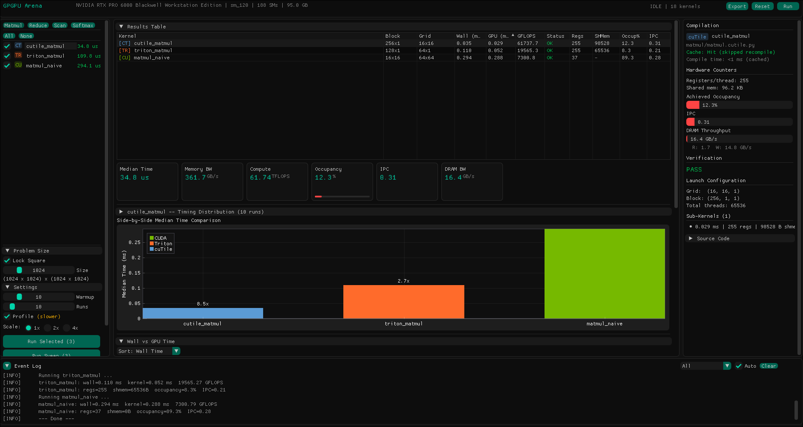
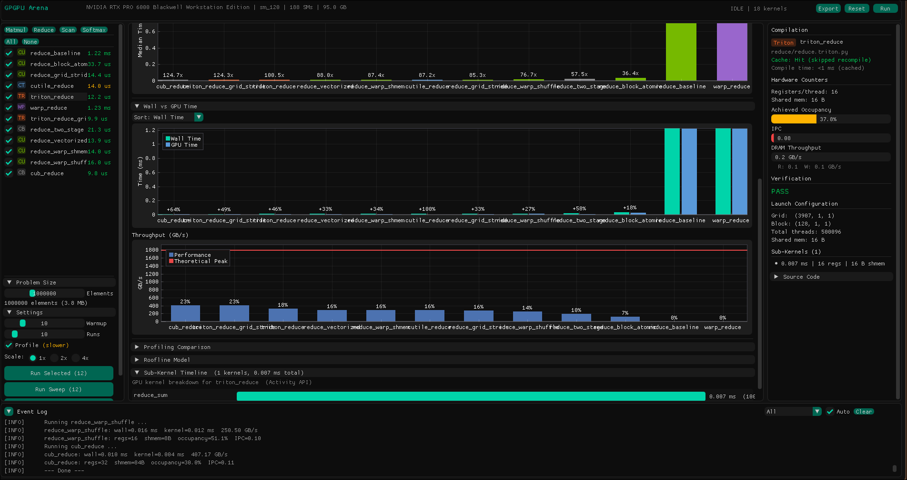
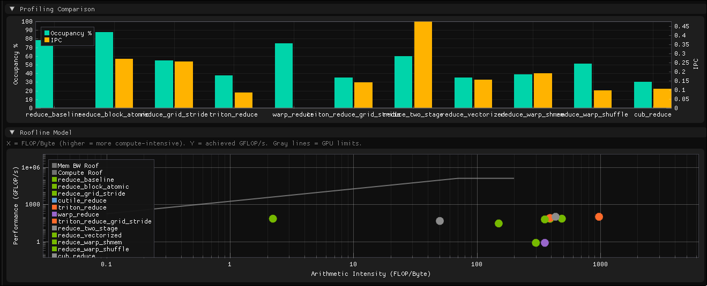
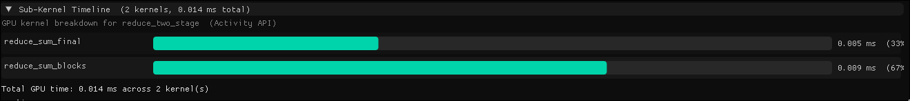

# GPGPU Arena

A CUDA kernel benchmarking platform. Write GPU kernels in CUDA C++, Triton, cuTile or any DSL benchmark them side by side with identical inputs and measurement infrastructure.



## Quick Start

Requires Docker with [NVIDIA Container Toolkit](https://docs.nvidia.com/datacenter/cloud-native/container-toolkit/install-guide.html).

```bash
# GUI mode (OpenGL window)
xhost +local:docker
docker compose up gui

# TUI mode (full-screen terminal UI, no X required)
docker compose up arena
```

## Terminal UI

The TUI (`./arena --tui` or `--cli`) is a full-screen terminal interface with
near-parity to the GUI: sortable results table, kernel list with checkboxes,
KPI cards, wall-vs-GPU bars, profiling comparison, roofline, sub-kernel
timeline, and a per-kernel detail panel. It uses pure ANSI escape codes (no
ncurses dependency) and works over SSH. Best at 120x40 or larger; minimum 80x20.

Keybindings (press `?` inside the TUI for the full list):

| Keys | Action |
| --- | --- |
| `j`/`k` or `↑`/`↓` | navigate kernel list (`g`/`G` for top/bottom) |
| `Tab` / `1`-`9` | switch category |
| `Space` | toggle kernel selection (checkbox) |
| `Enter` | focus kernel for the detail panel |
| `a` / `A` | select all / none |
| `r` / `s` | run selected / sweep across preset sizes |
| `c` | cancel a running benchmark |
| `p` | toggle hardware profiling (occupancy/IPC/DRAM) |
| `v` or `←`/`→` | cycle visualization panel |
| `o` / `O` | cycle sort column / reverse direction |
| `[` `]` `{` `}` | decrease / increase problem size (1.25x / 2x) |
| `-` `+` `,` `.` | warmup ± / runs ± |
| `e` / `R` / `C` | export CSV / reset results / clear compile cache |
| `l` | toggle log panel |
| `q` | quit |

## How It Works

```
Source (.cu / .triton.py / .cutile.py)
    |
    v
Runtime Compiler (nvcc / Triton / cuTile)  -->  .cubin (cached)
    |
    v
cuModuleLoad  -->  cuLaunchKernel  -->  Benchmark + Profile
```

All kernels compile to **cubin** (final SASS) at runtime on first use. Compiled cubins are cached on disk and subsequent runs skip compilation. Edit a kernel source file, re-run, and only that kernel recompiles.



## Adding a Kernel

Each kernel has two files: a **source** (GPU code) and a **descriptor** (C++ metadata).

### CUDA C++

```
kernels/reduce/my_kernel.cu     # GPU kernel with extern "C" __global__
kernels/reduce/my_kernel.cpp    # Descriptor: name, launch config, args, verification
```

### Triton

```
kernels/reduce/my_kernel.triton.py    # Triton @jit kernel + triton_base.main()
kernels/reduce/my_kernel.triton.cpp   # Descriptor using compile_result_
```

### cuTile

```
kernels/reduce/my_kernel.cutile.py    # cuTile @ct.kernel + cutile_base.main()
kernels/reduce/my_kernel.cutile.cpp   # Descriptor using compile_result_ + param buffer
```

The descriptor declares `needs_compilation() = true` and `source_path()`. The arena compiles, loads, benchmarks, and verifies automatically.

## Architecture

- **Runtime Compilers** (`src/arena/compilers/`) - one per DSL. `CudaCompiler` runs nvcc, `TritonCompiler` and `CuTileCompiler` run Python scripts. Disk-cached with mtime invalidation.
- **Kernel Loader** - loads `.cubin` via `cuModuleLoad`, launches via `cuLaunchKernel`.
- **Benchmark** - CUDA events, median over N runs.
- **Profiler** - CUPTI Activity API (kernel time, registers, shared memory) + Range Profiler (occupancy, IPC, DRAM throughput).
- **Runner** - orchestrates: compile -> warmup -> benchmark -> profile -> verify.

## Profiling

Side-by-side occupancy/IPC across kernels plus an arithmetic-intensity vs performance roofline:



Sub-kernel timeline (Activity API) breaks multi-launch kernels into their individual GPU invocations:



Hardware counter collection (occupancy, IPC, DRAM) requires GPU performance counter access:

```bash
echo "options nvidia NVreg_RestrictProfilingToAdminUsers=0" | sudo tee -a /etc/modprobe.d/nvidia-profiler.conf
sudo update-initramfs -u
sudo reboot
```

Without this, benchmarking still works - only the profiling pass will fail.
