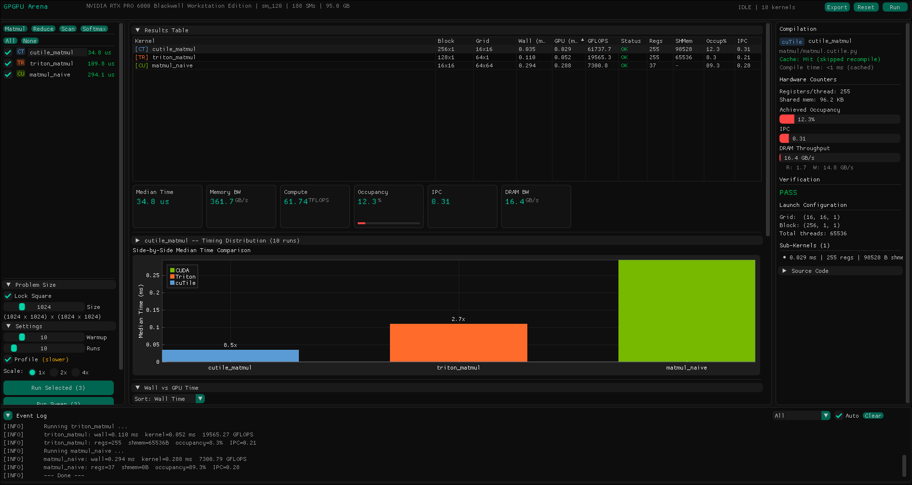
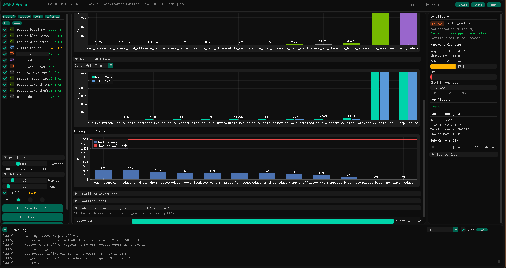
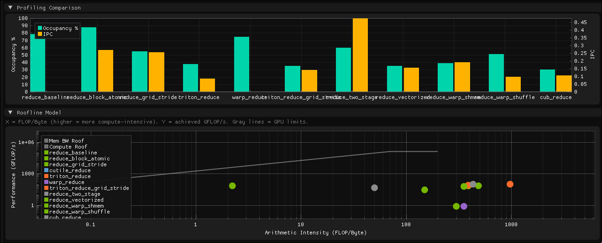
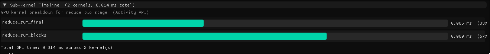

# GPGPU Arena

A CUDA kernel benchmarking platform. Write GPU kernels in CUDA C++, Triton, cuTile or any DSL benchmark them side by side with identical inputs and measurement infrastructure.



## Quick Start

Requires Docker with [NVIDIA Container Toolkit](https://docs.nvidia.com/datacenter/cloud-native/container-toolkit/install-guide.html).

```bash
xhost +local:docker
docker compose up gui
```

## Headless Mode

For scripting, CI, and agentic workflows. Writes JSON to stdout by default,
with console logging suppressed so the payload is machine-readable:

```bash
./arena --list                                    # kernels + categories as JSON
./arena --run reduce -p n=4000000 --runs 20       # run a category
./arena --run cub_reduce -p n=1000000 --profile   # one kernel, with counters
./arena --run all --energy -o results.csv --format csv
```

Exit codes are load-bearing, so callers can branch without parsing output:

| Code | Meaning |
| --- | --- |
| 0 | All kernels ran and verified |
| 1 | Ran, but at least one kernel failed verification |
| 2 | At least one kernel errored (compile, launch, or device failure) |
| 3 | Usage error |

JSON output carries environment provenance (device, driver, toolkit, clocks)
alongside the results, so a result file records what produced it. Run
`./arena --help` for the full flag list.

`-DBUILD_GUI=OFF` builds a headless-only binary with no GLFW/OpenGL
dependency.

## Measurement Model

Timing is reported in three tiers, which are **not** comparable with each
other and are never summed:

| Tier | Fields | Meaning |
| --- | --- | --- |
| Per-invocation | `op_ms`, `gpu_ms`, `overhead_ms`, `launch_count` | Whole operation vs. summed SASS. The gap is launch latency and inter-kernel sync. |
| Per-process | `module_load_ms`, `first_launch_ms` | Cold-start cost, paid once per process. |
| Build | `compile_ms`, `import_ms`, `invoke_ms` | One-time, cached to disk. `compile_ms` is the DSL compiler's own time, separate from Python interpreter startup. |

Throughput (GFLOPS, GB/s) divides by `op_ms`. Hardware counters divide by
`gpu_ms`, because the range profiler samples a single launch replay.

Warmup runs until timings stabilise rather than a fixed count, using median
drift between consecutive windows. A sliding-variance test would report a
steadily boosting clock as stable. Results record `warmup_converged` so you
can tell when a number was measured on an unsettled clock.

Energy uses NVML over a sustained back-to-back window, since NVML updates far
more slowly than a single kernel runs. It reports whole-board energy, so
`mj_per_op` is an upper bound on a kernel's marginal cost; the runner logs a
device-busy estimate and warns when the loop is launch-bound.

## Numerics

Kernels are judged on measured error, not a pass/fail. Every category compares
against a CPU reference accumulated in `double` and reports the max and mean
relative error alongside the tolerance it was judged against.

Two errors are reported, because they answer different questions:

- **arithmetic** is measured against the inputs the kernel actually received,
  already rounded to its storage type. This is the kernel's own doing, so it
  is what pass/fail is judged on, and it is comparable within a dtype.
- **total** is measured against the original fp32 data, so it includes what a
  narrower storage type cost before the kernel ever ran. This is the number
  comparable across dtypes, and the one the results table shows.

For an fp32 kernel the two are identical. For `reduce_fp16_accum_fp32` at 64M
they are `7.3e-07` and `6.6e-05`: its summation is as clean as a good fp32
kernel, and storing the inputs in half still costs it two orders of magnitude.

Tolerance comes from the storage type's mantissa, scaled by the square root of
the accumulation length, since summing more values legitimately costs
precision. A kernel that is merely imprecise then reads differently from one
that is wrong: `reduce_baseline` over 64M ones reports `7.4e-01`, which is an
fp32 accumulator saturating at 2^24, not a bug.

Input data is selectable with `--dist`:

| Distribution | Use |
| --- | --- |
| `ones` | Fast sanity check. Hides ordering bugs: every reduce kernel scores exactly zero. |
| `uniform` | Default. Mixed signs, so accumulation order starts to matter. |
| `normal` | Occasional large magnitudes. |
| `adversarial` | Mixed magnitudes, denormals and exact zeros. |

`--seed` makes a run reproducible; the CPU reference is regenerated from the
same numbers the GPU saw.

A kernel declares its input and output element types separately, since mixed
precision is the normal case: `reduce_fp16_accum_fp32` reads fp16 and writes
fp32. There is deliberately no accumulator type, because a kernel can have
several at different precisions; the framework models what crosses the buffer
boundary and leaves internals alone.

Tolerance follows from the output type. A kernel cannot produce an answer more
precise than the type it writes into, so that is the standard it is held to.
A kernel whose internals are coarser will miss it, which is the intended
result: `reduce_fp16_accum_fp16` writes fp32 but sums in half, and fails.

Dtype is part of a kernel's identity rather than a run-time switch, so the
fp16 variants are separate entries in the same `reduce` table. At n=4M:

| kernel | in>out | error | |
| --- | --- | --- | --- |
| `reduce_fp16_accum_fp16` | fp16>fp32 | 7.8e-03 | accumulates in half, fails |
| `reduce_fp16_accum_fp32` | fp16>fp32 | 1.5e-07 | accumulates in float |
| `reduce_fp16_out_fp16` | fp16>fp16 | 5.8e-04 | clean arithmetic, half output |

Supported storage types are fp32, fp16, bf16, both OCP fp8 variants
(e4m3 and e5m2) and fp4 (e2m1). Buffers are sized in bits, so fp4 packs two
values per byte, and tolerance is derived from the output type's mantissa
with a floor of half an ulp: a kernel is never asked to be more accurate
than the type it writes into.

NVFP4 is not usable yet. The element type is there, but the format is fp4
values with a shared e4m3 scale per 16 elements, and the base descriptors
allocate no second buffer for those scales. `dtype_is_block_scaled()` flags
it so nothing quietly treats it as a plain narrow type.

Sources live under `kernels/<category>/<input dtype>/`. The folder is named for
what a kernel reads, since that is what shapes the source: reading `__half*`
rather than `float*` changes the signature and the load path, while the output
type is a single store at the end. Variants sharing an input type but differing
in output live in the same file, which is why all three above are in
`kernels/reduce/fp16/accum.cu`.

## Known Issues

- **cuTile kernels fail to compile** against current `cuda-tile` releases:
  `'ndarray' object has no attribute 'symbol'`. `cutile_base.py` passes cupy
  ndarrays as dummy args to `compile_tile`, which newer versions no longer
  accept. Reproduces identically on older commits, so it is an upstream API
  change rather than a regression.

- The compile cache is keyed on source mtime alone, not on target
  architecture, compiler version, or compile flags. A cubin can outlive the
  toolchain that produced it and be reused silently. This has been observed
  producing wrong results that verification caught. Clear it with
  `rm build/kernels/*.cubin build/kernels/*.json` after a toolchain change.

## How It Works

```
Source (.cu / .triton.py / .cutile.py)
    |
    v
Runtime Compiler (nvcc / Triton / cuTile)  -->  .cubin (cached)
    |
    v
cuModuleLoad  -->  cuLaunchKernel  -->  Benchmark + Profile
```

All kernels compile to **cubin** (final SASS) at runtime on first use. Compiled cubins are cached on disk and subsequent runs skip compilation. Edit a kernel source file, re-run, and only that kernel recompiles.



## Adding a Kernel

Each kernel has two files: a **source** (GPU code) and a **descriptor** (C++ metadata).

### CUDA C++

```
kernels/reduce/my_kernel.cu     # GPU kernel with extern "C" __global__
kernels/reduce/my_kernel.cpp    # Descriptor: name, launch config, args, verification
```

### Triton

```
kernels/reduce/my_kernel.triton.py    # Triton @jit kernel + triton_base.main()
kernels/reduce/my_kernel.triton.cpp   # Descriptor using compile_result_
```

### cuTile

```
kernels/reduce/my_kernel.cutile.py    # cuTile @ct.kernel + cutile_base.main()
kernels/reduce/my_kernel.cutile.cpp   # Descriptor using compile_result_ + param buffer
```

The descriptor declares `needs_compilation() = true` and `source_path()`. The arena compiles, loads, benchmarks, and verifies automatically.

## Architecture

- **Compiler backends** (`src/arena/compilers/`) - one per DSL. `CudaBackend` runs nvcc; `TritonBackend`, `CuTileBackend` and `WarpBackend` run Python scripts that emit a cubin plus JSON metadata.
- **KernelCompiler** - picks a backend by file extension and owns the two-level cache (in-memory, then disk with mtime invalidation), the output naming, and the compile timing.
- **Kernel Loader** (`src/arena/device/`) - loads `.cubin` via `cuModuleLoad`, launches via `cuLaunchKernel`.
- **Measurement** (`src/arena/measurement/`) - warmup, timing, CUPTI profiling, NVML energy.
- **Runner** - orchestrates: compile -> warmup -> benchmark -> profile -> verify.

## Profiling

Side-by-side occupancy/IPC across kernels plus an arithmetic-intensity vs performance roofline:



Sub-kernel timeline (Activity API) breaks multi-launch kernels into their individual GPU invocations:



Hardware counter collection (occupancy, IPC, DRAM) requires GPU performance counter access:

```bash
echo "options nvidia NVreg_RestrictProfilingToAdminUsers=0" | sudo tee -a /etc/modprobe.d/nvidia-profiler.conf
sudo update-initramfs -u
sudo reboot
```

Without this, benchmarking still works - only the profiling pass will fail.
